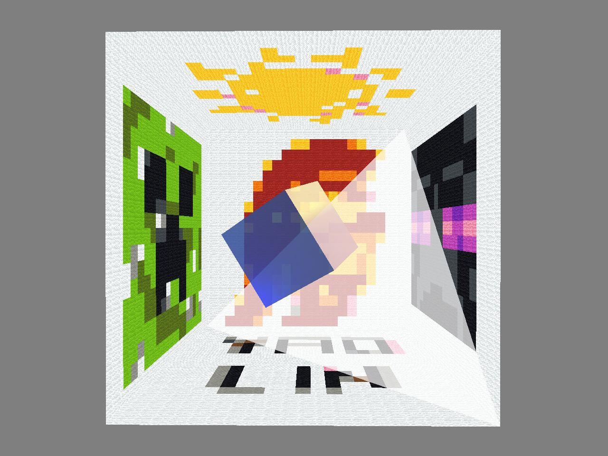
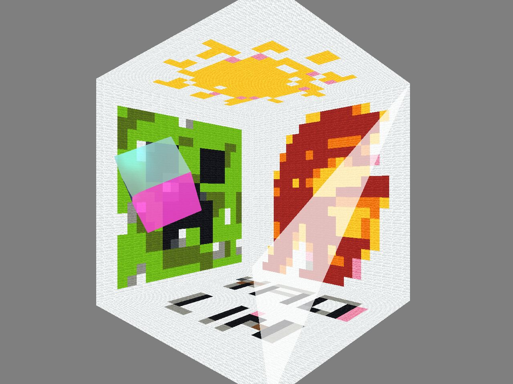

# Overview
CSCI 520 Assignment 1

By Yao Lin

Open Source on github: https://github.com/matudinglin/Computer-Animation-and-Simulation-Projects

Keywords: Physical Animation, Mass-Spring System, Interaction

# Requirments Check List
## Basic Requirements Check List
- Animate the movement of a jello cube based on a realistic physical model.
- Collision detection and response in a Bounding Box.
- Force field simulation, with force-field interpolation.
- Run at interactive frame rates (>100fps at 1280x760).
- Reasonably commented and written in an understandable manner.

## Animation Requirements Check List
- In results/...
  - 300 jpg sreenshots
  - 000.gif animation
  - 000.mp4 animation

## Extra Credits Check List
- Implement collision detection with an inclined plane.
- Make the animation interactive. Allow the user to interactively push the cube in a certain direction by dragging the mouse. 
  - Press left mouse and drag.
  - Move the cube from left to right, from back to front.
- FPS counter in Command Prompt.
- Custom struct Vector3d for clean formula.
- Arts
  - Minecraft style texture applied to the bounding box.
  - Enable blending to make cube and inclined plane transprant.
  - Background texture is Trojan icon from USC.
  - Left side and right side texture is monster heads from Minecraft.
  - Up side is the fake sun.
  - Down side is author's name.

# Showcase
Animation:

Images:

