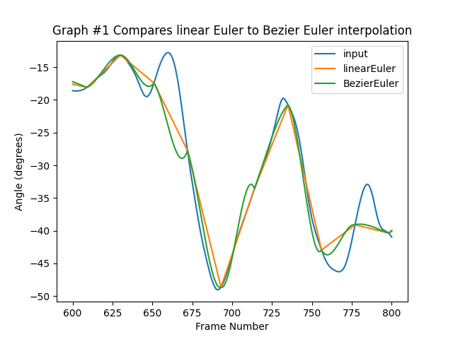
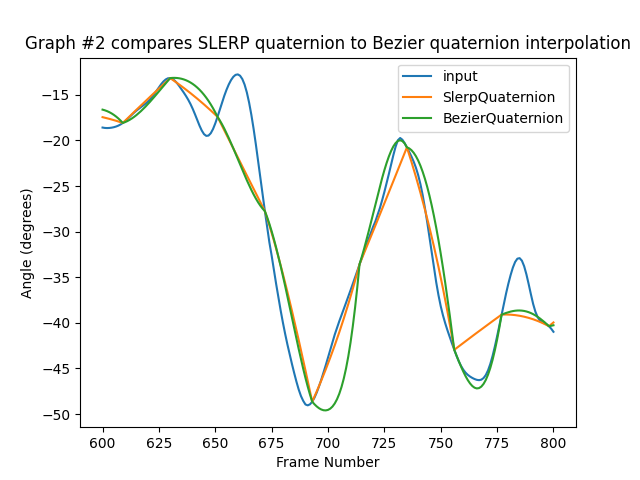
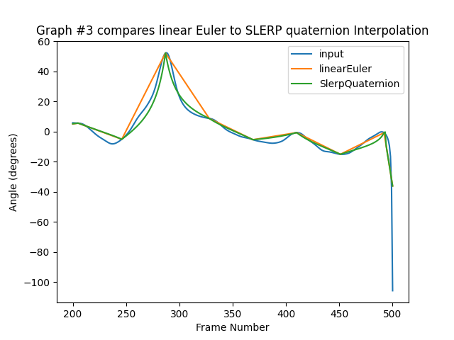
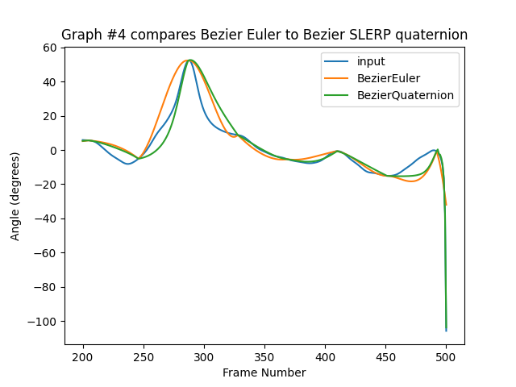

# Overview
CSCI 520 Assignment 2

By Yao Lin

Open Source on github: https://github.com/matudinglin/Computer-Animation-and-Simulation-Projects

Keywords: Motion Capture Interpolation, Quaternion, Bezier

# Requirments Check List
## Basic Requirements Check List
- Implements Bezier interpolation for Euler angles, as well as SLERP and Bezier SLERP interpolations for quaternions.
- Report comparing the four interpolation methods: linear Euler, Bezier Euler, SLERP quaternion, Bezier SLERP quaternion.
  - Four graphs
- Three videos.
  - ./Report/Bezier Euler.mp4
  - ./Report/Bezier quaternion.mp4
  - ./Report/SLERP quaternion.mp4
- Findings and observations.

## Extra Credits Check List
- Analyze the computation time of the different interpolation techniques.

# Graphs Anlysis
For each of these graphs, the X axis should be the frame number, and Y axis the angle in degrees. 

Plot graphs #1, #2 for lfemur joint, rotation around X axis, frames 600-800, for N=20, for 131_04-dance.amc input file. 

Plot graphs #3, #4 for root joint, rotation around Z axis, frames 200-500, for N=20, for 131_04-dance.amc input file.
## Graph #1

Graph #1 compares linear Euler to Bezier Euler interpolation (and input).

## Graph #2

Graph #2 compares SLERP quaternion to Bezier SLERP quaternion interpolation (and input).

## Graph #3

Graph #3 compares linear Euler to SLERP quaternion (and input).

## Graph #4

Graph #4 compares Bezier Euler to Bezier SLERP quaternion (and input).

# Observations and Findings 
Graphs #1 shows the results using two different interpolate methods by Euler angles. Linear interpolation generates straight lines between each keyframe angle, which are not how normal motions works. Bezier interpolation on the other hand, generates smoother inbetween angle values between each keyframe angle.

Graphs #2 shows the results using two different interpolate methods by Quaternions. Similar to Graph #1, inbetween angle values generated by Bezier method is more smoother.

Graphs #3 shows the results using LERP interpolate method by Euler and Quaternion. Compare to interpolate methods using Euler angles. The inbetween angle values generated by quaternion method has smoother and more stable curves, which is more close to input result.

Graphs #4 shows the results using Bezier interpolate method by Euler and Quaternion. Compare to interpolate methods using Euler angles. The Bezier Quaternion interpolation has the best result. 

In summary. represent rotation using Euler angles has its limitation. Unstable and abrupt results or even gimbal lock may happen, because three coordinates need to be interpolated separately. While using Quaternion doesn't have this limitation. Bezier interpolation can generate smoother curves than linear interpolation, because it's more natural to have curves in motion rather than straight lines.

# Computation time Analysis

The table below compare the computation time between four interpolation methods. Include 131_04-dance.amc and 135_06-martialArts.amc, for N = 20, count in milliseconds.

| Time Cost(ms)      | Linear Euler | Linear Quaternion | Bezier Euler | Bezier Quaternion |
|--------------------|--------------|-------------------|--------------|-------------------|
|  Dance(N=20)       | 76           | 442               | 347          | 869               |
| Martial Arts(N=20) | 241          | 1349              | 1120         | 2597              |

In summary, Bezier Euler is more time consuming than Linear methods, because it need more computation using De Casteljau algorithm. Quaternion is more time consuming than Euler methods, because it need to convert Euler angles to Quaternion, after compute, then convert it back to Euler angles. Although Euler has disadvantages, it is more intuitive, and easy to represent.

